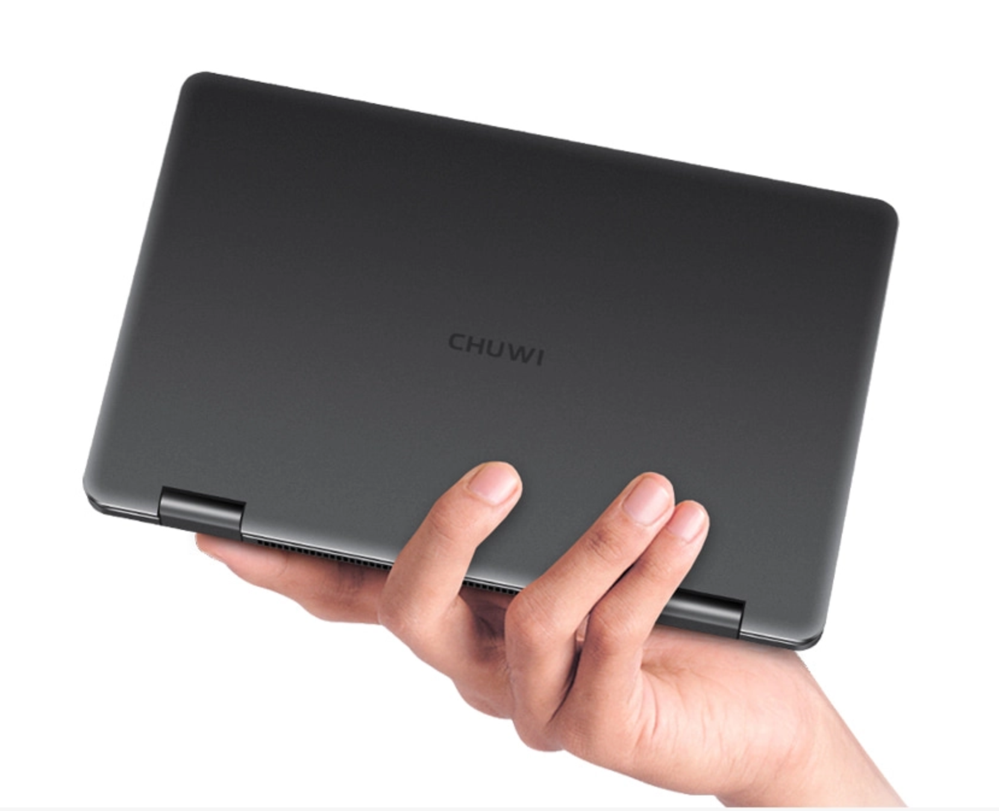
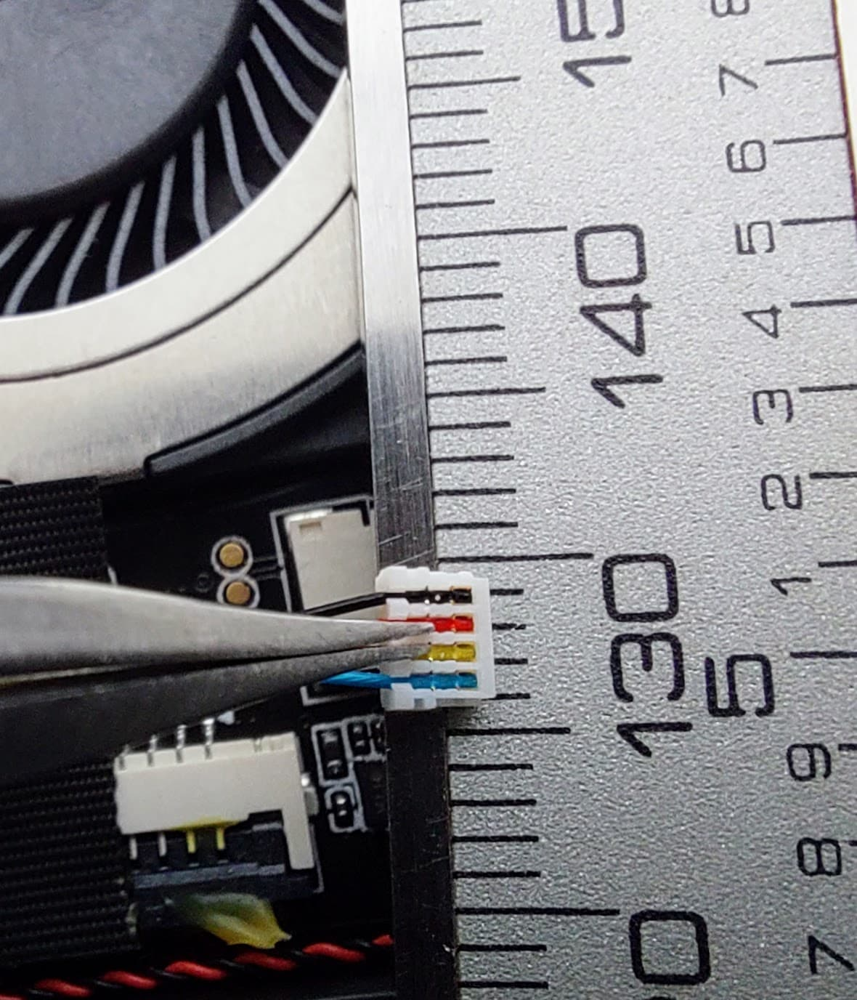
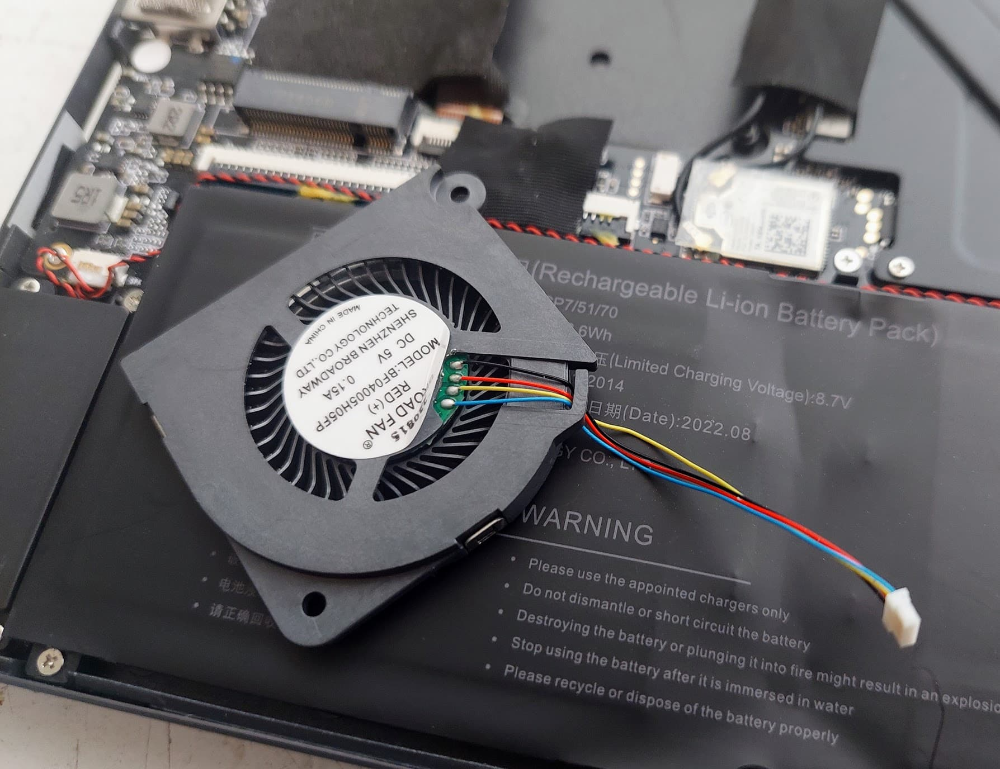
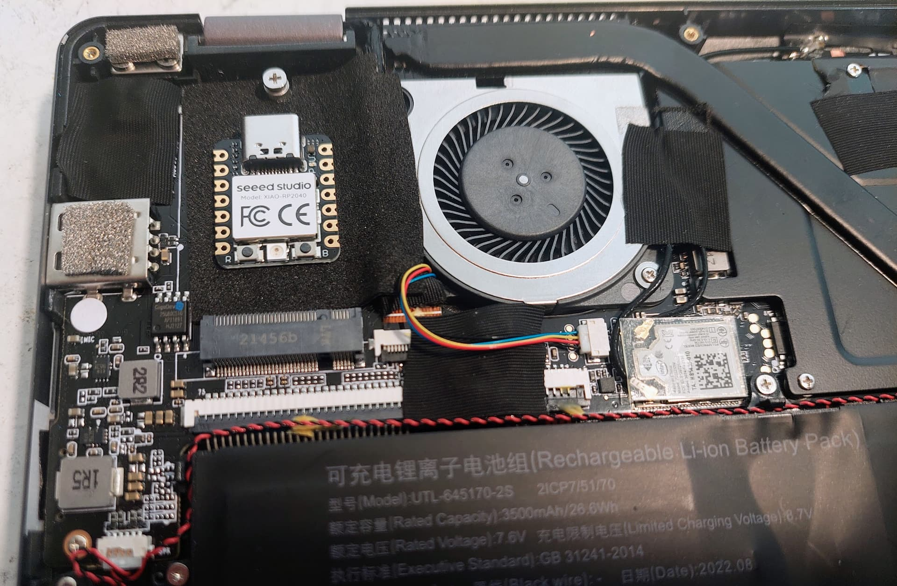

[CHUWI MiniBook 8.0 inchs](https://www.chuwi.com/pt/product/items/Chuwi-MiniBook.html) is a mini laptop. I bought mine in 2023 and this version has a X86 Intel Celeron J4125 processor, 6ĜB RAM and 128GB SSD disk.

**What I like**

* screen quality: good
* touch screen: good
* keyboard keys size: good
* keyboard with backlight: good to have but not possible to control the intensity
* Optical Finger: while far from perfect, it works ok
* compact size

**What I do not like**

* fan makes an undesirable noise
* keyboard backlight can't be controlled in intensity and is always on or always off
* weights more than what I expected

# Improving fan noise

I did open my Chuwi Minibook. A picture of the fan connector, near a rule with 1mm scale, so, I would say the pitch of this connector is about 0.875mm (4 wires in 3 5mm). Anyone can find the reference of this type of connector?
 

And a detail of the fan. Most probably the best option is to remove and solder here the wires, even because we can buy a spare fan in the case we damage the original:

And I tested a RPI2040 very small board that is programmed using the USB-C connector. It can run high level Pyhton firmware. Since it can be installed on the SSD M2 disc space, it will be great to open the M2 cover and connect the USB-C cable, during the development:

But for now, I just did as other user did -- **I just left the fan unconnected!!** and the Minibook boots and runs as if there is no issue at all. Maybe the system firmware do not force the fan to run, maybe it is ready for a fanless system. And as the other user wrote, if the Minibook get's hot, it will probably protect itself by reducing the system clock, making the system slow but keep the temperature at safe levels.
